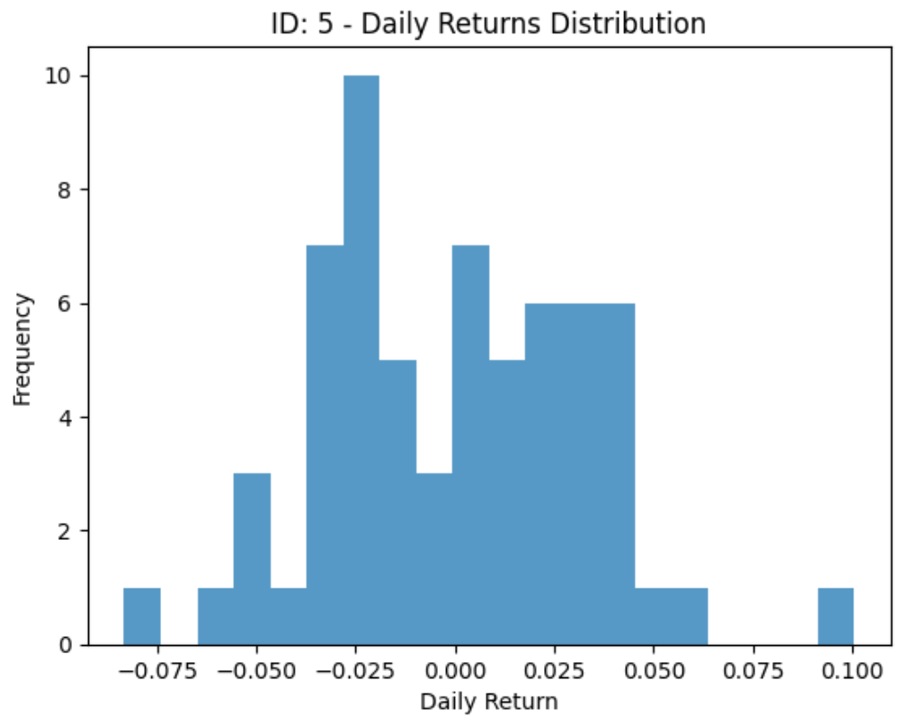
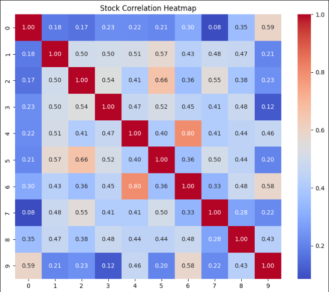
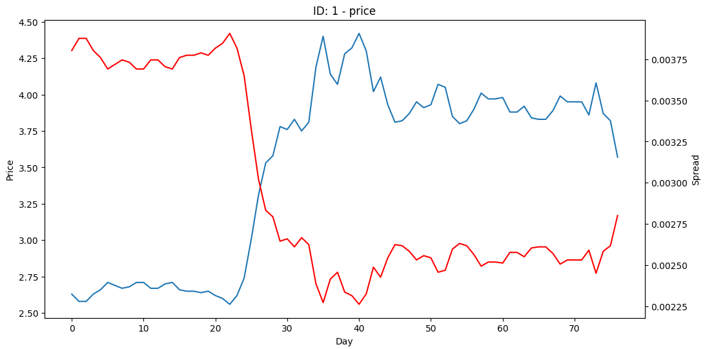

# LOB-Analysis-Report

# 基于LOB进行不同周期涨跌预测的实验报告

**朱羿州**  📧:<zhuyizhou2333@gmail.com>

**陈奕玮**  📧:<yiweichen211@gmail.com>

## 任务描述

- **预测目标：** 用过往及当前数据预测未来中间价的移动方向
- - 0代表中间价下跌，1代表不涨不跌，2代表上涨。
  - 对于预测窗口为5tick，10tick，不涨不跌的认定阈值取0.05%
  - 对于预测窗口20tick，40tick，60tick，不涨不跌的认定阈值取0.1%
- **输入数据：**

  - 行情频率:3秒一个数据点(也称为1个tick的snapshot)
  - 每个数据点包括当前最新成交价，五档量价，过去3秒内的成交金额，时间戳，标的，日期
  - 训练集中每个数据点包含5个预测标签的标注
  - 一共包括10只股票79个交易日的快照数据
    - 挂单价格进行匿名处理：用相对前一个交易日收盘价的涨跌幅表示
    - 挂单金额进行匿名处理：用换手率代替
    - 日期进行匿名处理：重置为0-78
- 允许利用过去不超过100tick(包含当前tick)的数据，预测未来N个tick后的中间价移动方向

  

## 数据分析及初步处理

### 订单簿可视化


如图所示，展示了某只股票在早盘交易时段的成交与订单簿挂单情况。卖方不断抛出市价订单，价格随之下跌。在9:42:03遭到大额限价买单阻拦，价格小幅反弹。20s后卖方继续抛售，通过市价单清除关键位置买方流动性。

### 数据量检测

+ 发现由于有些标的存在停牌情况，数据无法完全对齐。

### tick size检测

+ 描述平均价差与最小跳点之间的关系。如果平均价差大于三倍最小跳动单位，则定义为小跳点票；如果平均价差小于一点五倍最小跳动单位，则定义为大跳点票；其余的定义为中等跳点票。
+ 根据已有研究，小跳动点股票相对大跳动点股票更易于使用深度学习方法进行预测。
+ 发现10支票中，只有2、8属于小跳点票，其他的都属于中等跳点票。

### 波动率分析

+ 发现大多数股票的日回报率基本符合正态分布。存在少量涨跌停现象。

  

### 相关性分析

+ 相关系数热图如下所示：



+ 如果取0.55为界，可以看出0-9，1-5，2-7，4-6，6-9之间存在较强的相关性，训练时有数据泄露可能。

### 逆向分析

还原数据原始价格，观察其价格走势和价格大小。



分析得到ID：1，3是低价股（2-5元），0，2，9是高价股（大于50元），其余为中等价位股票（10元左右）。全部股票走势均呈现上涨趋势，部分股票实现了接近一倍的涨幅。

## 特征工程

+ 目前我们大约使用了150+因子，衍生方法为：先发现一个订单簿异象，再通过多种函数对同一异象进行描述，再通过基础算子对函数进行衍生。因子函数描述如下，同时给出部分因子计算函数：

### 基础因子

+ 各档买卖价之间的差值，总计五个因子。
+ 各档买卖价的平均值，总计五个因子。
+ 各档价差和均值的比值，总计五个因子。
+ 过去一段时间买一价和卖一价的均值，总计两个因子。
+ 买一卖一挂单量之差，以及五档买单卖单挂单量之差，总计两个因子。
+ 中间价在过去不同周期的变化趋势，总计三个因子。
+ 各档报单量与总报单量的比值，总计三个因子。

### 流动性因子（做市商因子）

+ 平均流动性（及挂单量之和）以及流动性的标准差、偏度，总计三个因子。
+ 归一化流动性，总计一个因子。
+ 流动性韧劲以及流动性匮乏因子，总计六个因子。

  ```python
  def TED_1(bid_size,ask_size):
      '''描述流动性的韧劲，低于平均值一个标准差之后恢复的平均用时'''
      total_liquid = bid_size + ask_size
      sum_liquid = np.sum(total_liquid,axis=1)
      liquid_mean = np.mean(sum_liquid)
      liquid_std = np.std(sum_liquid)
      liquid_lack = sum_liquid < liquid_mean - liquid_std
      liquid_lack.astype(int)
      sum = np.sum(liquid_lack)
      diff = np.diff(liquid_lack)
      count = 0
      for i in liquid_lack:
          if i > 0:
              count += 1
      returnsum / (count + 1)
  ```
+ 买单卖单的平均年龄，买卖价的变化程度、数量敏感度等，总计七个因子。

  ```python

  def _bid_quantity_sensitive(bid,bid_size):
      '''买价的数量敏感度'''
      now_bid = bid[-1,:]
      now_bid_size = bid_size[-1,:]
      return (now_bid[0] - now_bid[len(now_bid)-1]) / np.sum(now_bid_size)
  ```

### 其他：

- 力量因子

  - 主买主卖力量强弱对比
  - 第二种定义主买的方法,计算本窗口中主买的次数占主买主卖次数和的比例
  - 置信正态分布主动占比
  - t分布主动占比
  - 来自于残差资金流强度因子构建，分子为大单买额-大单卖额,分母为abs(大单买额-大单卖额)
  - 来自于残差资金流强度因子构建，分子为小单买额-小单卖额，分母为abs(小单买额-小单卖额)
- 价格跳档因子

  - 价格上涨，跳档次数
  - 价格下跌，跳档次数
  - 净跳档次数
  - 高频成交量波动
  - 跳跃度
- 流动性因子

  - 滚动窗口中有多少个bid和ask是连续一样的
  - 单位收益率由多少成交量推动
  - 有多少个bp1是一样的
  - 多少个ap1是一样的
- 收益率相关因子

  - 高频上行波动占比
  - 高频下行波动占比
  - 上下行波动率跳跃的不对称性
  - 高频已实现偏度

    ```python
    def _ret_skew(bid, ask):
        '''高频已实现偏度，刻画股票日内快速拉升或下跌的特征，与收益率负相关'''
        # 计算中间价
        mid = (ask[:, 0] + bid[:, 0]) / 2
        # 计算对数收益的平方
        yRtn = np.square(np.diff(np.log(mid)))
        # 计算所有值的偏度
        n = len(yRtn)
        mean_yRtn = np.mean(yRtn)
        std_yRtn = np.std(yRtn)
        # 计算偏度
        skewness = (n / ((n - 1) * (n - 2))) * np.sum(((yRtn - mean_yRtn) ** 3) / (std_yRtn ** 3))
        return skewness
    ```
- 量价相关性因子

  - 已实现波动率
  - 成交量变化率和收益率的相关性
  - 成交额自相关性
- 失衡因子

  - 订单簿不平衡
  - 交易不平衡
  - 深度不平衡
  - 价格高度不平衡
- 交易因子

  - 成交量均值
  - 成交量标准差
  - 超越最佳买价的买方成交量占比
  - 超越最佳卖价的卖方成交量占比
  - 高低价差
  - 相对扩散率

  ```python
    def RSpread(bid, ask):
        '''相对扩散率'''
        # 计算相对扩散率
        r_spread = (ask[:, 0] - bid[:, 0]) / (ask[:, 0] + bid[:, 0])
        return [np.mean(r_spread), np.std(r_spread), _gini(r_spread)]
  ```

  - 挂单量相对扩散率
  - 指数价格差比率
- 价格、成交量、买单挂单量与卖单挂单量的RSI指标
- 过去一定时间内出现放量的tick比例

## 模型训练

目前我们使用了多种模型进行训练，包括XGBoost、RandomForest、DeepLOB、AxialLOB等。其中XGBoost模型目前训练结果表现最优。

### XGBoost

+ XGBoost是一种常用的boosting算法。其主要原理是构建决策树做为弱分类器，并将许多单独的决策树按照一定的顺序组合在一起构成强分类器。
+ 我们再对每支票的数据进行特征衍生计算后，将数据保存。分别用每一支股票的数据以及所有股票集合在一起的数据，对不同的标签（label5-label60）分别进行了训练，产生了一系列模型。发现label5和label20是训练效果较优。
+ XGBoost在训练当中，可以修改的超参数主要包括：

```python

params = {
    'booster': 'gbtree',
    'eta': 0.1,
    'max_depth': 2,
    'min_child_weight': 1,
    'gamma': 0,
    'subsample': 0.8,
    'colsample_bytree': 0.8,
    'objective': 'multi:softmax',
    'num_class': 3, 
    'eval_metric': 'mlogloss'
}

```

以及训练轮次等参数。

+ 在训练过程中，我们尝试对 ``max_depth``、``min_child_weight``、``num_round``、``weights``等参数进行了寻优。发现调优效果比较显著的是针对树高的调优（不同股票对应的最佳树高差异很大，反映出模型预测的困难程度差异也很大），以及对于不同标签权重的调整（主要涉及了准确率和召回率之间的权衡取舍）。
+ **模型训练的关键操作**：
+ 数据集划分：为了防止数据集的泄露，采用顺序划分的方式，按照8:2的比例划分训练集和验证集。
+ 训练类型：使用'multi:softprob'作为目标函数。
+ 类别输出：选定概率阈值，只有上涨下跌预测概率高于此阈值才预测，否则输出1（不涨不跌）。通过网格搜索，寻找不同标的对应的最佳概率阈值。

### AxialLOB

我们在最开始也尝试了基于深度学习模型的预测。通过阅读查找文献，选定含有Transformer架构的AxialLOB模型，但是实现效果并不优秀。推测是因为输入数据未经过合适的标准化，导致均值和方差存在较大随机性，模型无法在不经过仔细调整的情况下学到全局最优解。

## 实验结果

### label20模型

+ 发现对于不同的票，预测难度存在很大差异，预测结果也存在很大差异。对于部分预测效果较好的股票，可以达到类似如下所示的数据：

```log
2024-12-23T18:49:31.361447+0800 | SUCCESS | 
stock_id:7, label_number:2, threshold:0.5900000000000001
2024-12-23T18:49:31.362523+0800 | SUCCESS | 
stock_id:7, label_number:2, num_round:100
2024-12-23T18:49:52.222854+0800 | SUCCESS | 
accuracy_score:0.5845698269172909
2024-12-23T18:49:52.224810+0800 | SUCCESS | 
              precision    recall  f1-score   support

         0.0     0.6792    0.0223    0.0431     13788
         1.0     0.5826    0.9962    0.7353     36373
         2.0     0.7357    0.0287    0.0553     12988

    accuracy                         0.5846     63149
   macro avg     0.6659    0.3491    0.2779     63149
weighted avg     0.6352    0.5846    0.4443     63149

2024-12-23T18:49:52.228561+0800 | SUCCESS | 
confusion_matrix:
[[  307 13409    72]
 [   76 36235    62]
 [   69 12546   373]]
2024-12-23T18:49:52.230565+0800 | SUCCESS | 
f_0_5_score:[0.09842267 0.63540523 0.12420085]
2024-12-23T18:49:52.231565+0800 | SUCCESS | 
f_1_score:[0.04311798 0.73526577 0.05527973]
2024-12-23T18:49:52.232565+0800 | SUCCESS | 
weighted_f_0_5_score:0.11131176245210203
2024-12-23T18:49:52.233573+0800 | SUCCESS | 
weighted_f_1_score:0.049198855381310594

2024-12-23T18:49:52.325560+0800 | INFO | Trade count for label 0: 452
2024-12-23T18:49:52.325560+0800 | INFO | Trade count for label 2: 507
2024-12-23T18:49:52.327299+0800 | INFO | Average pnl for label 0: 19.284994484295225
2024-12-23T18:49:52.328378+0800 | INFO | Average pnl for label 2: 37.3676227612456
2024-12-23T18:49:52.329391+0800 | INFO | total average pnl: 28.844840716217895
```

经过测试，label5具有最佳的预测精确度，但是label20由于时间更长，所以收益率更加可观。我们最终提交的模型只对label20进行预测，标的为1、2、3、4、7。在公榜上的表现如下：


## 未来的工作

由于时间仓促和数据集限制，我们仍留存了大量未完成的工作，包括

+ 未对因子进行单因子回归检验，评价因子质量水平
+ 未对特征重要性进行检验，去除部分对模型有害的因子
+ 未使用增强标签或回归模型拟合
+ 未对低价股和高价股进行聚类训练
