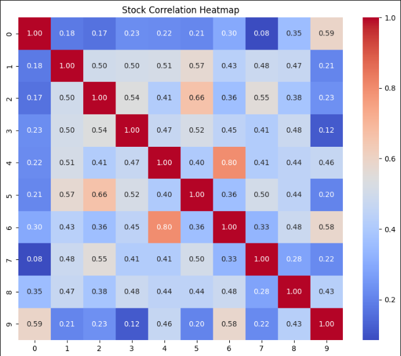
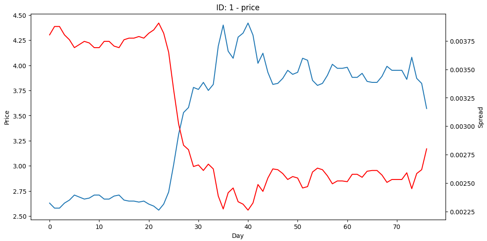
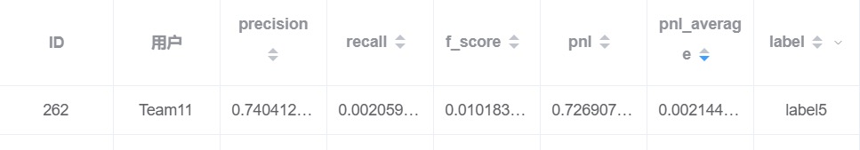
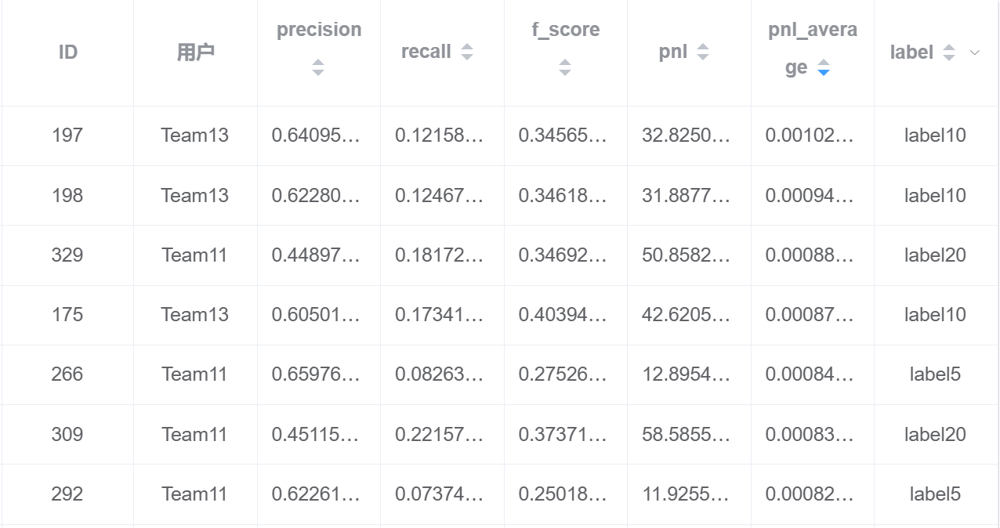

# 基于LOB进行不同周期涨跌预测的实验报告

**朱羿州 陈奕玮**

## 数据分析及初步处理

### 数据量检测

+ 发现由于有些标的存在停牌情况，数据无法完全对齐。

### tick size检测

+ 描述平均价差与最小跳点之间的关系。如果平均价差大于三倍最小跳动单位，则定义为小跳点票；如果平均价差小于一点五倍最小跳动单位，则定义为大跳点票；其余的定义为中等跳点票。
+ 发现10支票中，只有2、8属于小跳点票，其他的都属于中等跳点票。

### 波动率分析

+ 发现大多数股票的波动率基本符合正态分布。存在少量涨跌停现象。

### 相关性分析

+ 相关系数热图如下所示：



+ 如果取0.55为界，可以看出0-9，1-5，2-7，4-6，6-9之间存在较强的相关性，训练时有数据泄露可能。

### 逆向分析

还原数据原始价格，观察其价格走势和价格大小。



分析得到ID：1，3是低价股，0，2，9是高价股。全部股票走势均呈现上涨趋势。

## 特征工程

+ 目前我们大约使用了150+因子，衍生方法为：先发现一个订单簿异象，再通过多种函数对同一异象进行描述，再通过基础算子对函数进行衍生。因子描述如下：

### 基础因子

+ 各档买卖价之间的差值，总计五个因子。
+ 各档买卖价的平均值，总计五个因子。
+ 各档价差和均值的比值，总计五个因子。
+ 过去一段时间买一价和卖一价的均值，总计两个因子。
+ 买一卖一挂单量之差，以及五档买单卖单挂单量之差，总计两个因子。
+ 中间价在过去不同周期的变化趋势，总计三个因子。
+ 各档报单量与总报单量的比值，总计三个因子。

### 流动性因子（做市商因子）

+ 平均流动性（及挂单量之和）以及流动性的标准差、偏度，总计三个因子。
+ 归一化流动性，总计一个因子。
+ 流动性韧劲以及流动性匮乏因子，总计六个因子。
+ 买单卖单的平均年龄，买卖价的变化程度、数量敏感度等，总计七个因子。

### 其他：

- 力量因子 ：6
- 价格跳档因子：5
- 流动性因子： 4
- 收益率相关因子：4
- 量价相关性因子：3
- 订单簿失衡因子：1
- 价格、成交量、买单挂单量与卖单挂单量的RSI指标：4
- 过去一定时间内出现放量的tick比例：1

## 模型训练

目前我们使用了多种模型进行训练，包括XGBoost、RandomForest、DeepLOB、AxialLOB等。其中XGBoost模型目前训练结果表现最优。

### XGBoost

+ XGBoost是一种常用的boosting算法。其主要原理是构建决策树做为弱分类器，并将许多单独的决策树按照一定的顺序组合在一起构成强分类器。
+ 我们再对每支票的数据进行特征衍生计算后，将数据保存。分别用每一支股票的数据以及所有股票集合在一起的数据，对不同的标签（label5-label60）分别进行了训练，产生了一系列模型。发现label5和label20是训练效果较优。
+ XGBoost在训练当中，可以修改的超参数主要包括：

```python
params = {
    'booster': 'gbtree',
    'eta': 0.1,
    'max_depth': 2,
    'min_child_weight': 1,
    'gamma': 0,
    'subsample': 0.8,
    'colsample_bytree': 0.8,
    'objective': 'multi:softmax',
    'num_class': 3, 
    'eval_metric': 'mlogloss'
}
```

以及训练轮次等参数。

+ 在训练过程中，我们尝试对 ``max_depth``、``min_child_weight``、``num_round``、``weights``等参数进行了寻优。发现调优效果比较显著的是针对树高的调优（不同股票对应的最佳树高差异很大，反映出模型预测的困难程度差异也很大），以及对于不同标签权重的调整（主要涉及了准确率和召回率之间的权衡取舍）。

### AxialLOB

我们在最开始也尝试了基于深度学习模型的预测。通过阅读查找文献，选定含有Transformer架构的AxialLOB模型，但是实现效果并不优秀。推测是因为输入数据未经过合适的标准化，导致均值和方差存在较大随机性，模型无法在不经过仔细调整的情况下学到全局最优解。

## 实验结果

### label5模型

+ 发现对于不同的票，预测难度存在很大差异，预测结果也存在很大差异。对于部分预测效果较好的股票，可以达到类似如下所示的数据：

```plaintext
              precision    recall  f1-score   support

         0.0     0.5752    0.2658    0.3636      2374
         1.0     0.9449    0.9841    0.9641     57686
         2.0     0.5304    0.2709    0.3586      2289

    accuracy                         0.9306     62349
   macro avg     0.6835    0.5069    0.5621     62349
weighted avg     0.9156    0.9306    0.9190     62349

confusion_matrix:
[[  631  1691    52]
 [  419 56770   497]
 [   47  1622   620]]

f_0_5_score:[0.46657794 0.95245925 0.44508256]

f_1_score:[0.36358398 0.96409072 0.35858878]
```

```plaintext
              precision    recall  f1-score   support

         0.0     0.6772    0.1651    0.2655     19869
         1.0     0.4328    0.9278    0.5902     24606
         2.0     0.6486    0.1724    0.2724     17874

    accuracy                         0.4682     62349
   macro avg     0.5862    0.4218    0.3761     62349
weighted avg     0.5725    0.4682    0.3957     62349

confusion_matrix:
[[ 3281 15771   817]
 [  923 22830   853]
 [  641 14151  3082]]
 
f_0_5_score:[0.41797243 0.48447885 0.41781899]

f_1_score:[0.26551752 0.59024277 0.27242995]
```

```plaintext
              precision    recall  f1-score   support

         0.0     0.6656    0.1594    0.2571     16203
         1.0     0.5388    0.9471    0.6868     31219
         2.0     0.6503    0.1815    0.2838     15727

    accuracy                         0.5543     63149
   macro avg     0.6182    0.4293    0.4092     63149
weighted avg     0.5991    0.5543    0.4762     63149

confusion_matrix:
[[ 2582 12968   653]
 [  769 29568   882]
 [  528 12345  2854]]
 
f_0_5_score:[0.40701157 0.58960769 0.42874741]

f_1_score:[0.2571457  0.68682927 0.28375423]
```

+ 针对其中训练效果最优的股票，我们进行单只股票的预测提交，发现达到了如下图所示的效果：



+ 达到了约百分之七十四的准确率，总召回率大约千分之二（其他九只票均未进行交易，并且选取的这一支票出现上涨和下跌的比例明显小于平均值）。在公榜评测的十天中，大约交易340次，平均pnl大约千分之二。
+ 除了针对单支票进行预测和提交外，我们还针对所有股票的数据进行了训练和提交。如下图所示：



+ 可以看到，在一定程度上放弃召回率（百分之七到百分之八）的情况下，我们提交的模型（ID:266、292）准确率约为百分之六十五左右。平均pnl大约为千分之八。

### label20模型

+ label20模型与label5模型相比，由于时间更长，因此预测更困难，整体准确率相对较低。
+ 但是考虑到持有时间更长，所以收益率更加可观。目前公榜上我们提交平均pnl最高的模型即为label20模型，平均pnl约为万分之九。
